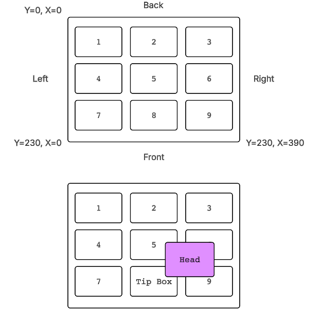

# Hardware setup

How to identify your Bravo, put it on the network, describe it in a profile,
teach its deck locations, and attach optional accessories. Work through this
page once per instrument; after that the profile carries the configuration.

> [!WARNING]
> Everything below results in a machine that moves. An incorrect
> `controller_type`, a wrong axis scale, or a mistaught deck location will
> drive the head into the deck. Read [safety.md](safety.md) first, keep a hand
> on the emergency stop, and verify each change in simulation before running it
> on hardware.

---

## 1. Identify your instrument

OpenBravo supports several Bravo generations. Each is selected by the
`controller_type` field in the profile's `connection` section.

| Instrument generation | `controller_type` | Connection | Notes |
|---|---|---|---|
| Darwin-generation Bravo | `darwin_native` | TCP, port 7613 | Ethernet only |
| Agile 7612 Bravo | `agile_7612` | TCP, port 7612 | Ethernet only |
| Bravo SRT | `agile_srt` | TCP, port 7612 | Ethernet only; four axes, no gripper |
| Legacy Agile Bravo | `agile` | Serial, or TCP port 10000 | RS-232 at 115200 8-N-1 with RTS/CTS |
| No hardware | `simulation` | — | Default; runs entirely in software |

### Telling them apart

If you do not know which generation you have, the TCP port the instrument
listens on is the most reliable signal. From the host machine, try each port in
turn:

```bash
nc -z -w2 192.168.1.50 7613   # Darwin
nc -z -w2 192.168.1.50 7612   # Agile 7612 or Bravo SRT
nc -z -w2 192.168.1.50 10000  # legacy Agile
```

Additional distinguishing details, all of which the driver relies on:

- **Darwin-generation** instruments answer the UDP discovery broadcast with a
  reply that identifies itself as `DARWIN`, and serve the Gemini protocol on
  TCP 7613.
- **Agile 7612** covers the Bravo 16050-02 (firmware 5.4.6) and Bravo 16060-02
  (firmware 5.4.7). It uses the same command family as the legacy Agile but a
  different frame layout, checksum, and controller identity value, so it is not
  interchangeable with `agile`.
- **Bravo SRT** (firmware 5.4.3) speaks the same wire protocol as the Agile
  7612 on the same port, but has no gripper: only the X, Y, Z, and W axes
  exist. Use `agile_srt`, not `agile_7612`, or homing will attempt axes the
  machine does not have.
- **Legacy Agile** instruments are the only ones that support a serial
  connection. Over Ethernet they listen on TCP 10000.

If a `agile_7612` machine is configured as `agile` (or vice versa) the
connection either fails outright or the controller identity check rejects the
device. That check is deliberate — it is cheaper to fail at connect time than
to send a misinterpreted move command.

---

## 2. Network setup

### Put the host and the instrument on the same subnet

Bravo instruments use a fixed IPv4 address set in the instrument's own
firmware, and OpenBravo talks to them over plain TCP. There is no routing or
NAT support, so the host running OpenBravo must have an interface on the same
subnet as the instrument.

A typical arrangement is a dedicated instrument network — either a direct
Ethernet cable between the host and the instrument, or both plugged into an
isolated switch:

| Device | Address | Netmask |
|---|---|---|
| Host running OpenBravo | 192.168.1.10 | 255.255.255.0 |
| Bravo | 192.168.1.50 | 255.255.255.0 |

Points worth checking:

- The host interface should be configured with a **static** address. A DHCP
  lease that moves the host onto another subnet will silently break discovery
  and connection.
- Local firewalls must allow outbound TCP to the instrument port, and inbound
  UDP on port 7611 if you want broadcast discovery to work.
- Do not put the instrument on a network that reaches the public internet. The
  protocols are unauthenticated and unencrypted.

### Finding the instrument's address

If you already know the address, put it straight into the profile
(`connection.address`) and skip ahead. Otherwise use the discovery endpoint:

```bash
curl -X POST http://localhost:8000/api/discover_devices \
     -H 'Content-Type: application/json' \
     -d '{"adapter": "All interfaces"}'
```

Request fields:

| Field | Default | Purpose |
|---|---|---|
| `adapter` | `"All interfaces"` | Restrict the search to one host interface, given by its IPv4 address. Any other value limits both the broadcast and the sweep to that adapter. |
| `controller_type` | active profile's value | Overrides the profile for this call only. When it resolves to `simulation`, the endpoint returns a single clearly-labelled virtual device and does no network traffic. |

The handler runs three probes concurrently and merges the results by IP
address:

1. **UDP broadcast.** A short discovery datagram is sent to the broadcast
   address of each selected adapter on **UDP port 7611**, and replies are
   collected for about a third of a second. A reply carries the responder's
   service port and a device-type string, which is how Darwin-generation
   instruments are recognised.
2. **TCP subnet sweep.** Candidate addresses are probed in parallel — first
   **port 7613** (Darwin), then **port 10000** with a protocol ping (legacy
   Agile). The candidate list is the host addresses of every selected adapter's
   subnet, plus a built-in default private `/24`. Subnets larger than `/22` are
   skipped rather than swept, and the whole sweep is bounded by a ten-second
   timeout.
3. **Directed probe.** If the active profile already has an address, that
   single address is probed with the same two-port check. This makes a
   known-good machine reappear even when the broadcast is silent and the sweep
   is scoped elsewhere.

The response lists the merged devices and the host interfaces that were
examined:

```json
{
  "devices": [
    {
      "device_id": "SERIAL-OR-IP",
      "device_type": "DARWIN",
      "ip_address": "192.168.1.50",
      "mac_address": "00-00-00-00-00-00",
      "status": "Matched",
      "controller_type": "darwin_native"
    }
  ],
  "adapters": [{"name": "en0", "ip": "192.168.1.10"}]
}
```

`status` is `Matched` when the address equals the one already in the profile,
and `Found` otherwise; matched devices are sorted first.

**Two limitations to be aware of.** The TCP sweep probes ports 7613 and 10000
only, so an **Agile 7612 or Bravo SRT instrument (port 7612) is discovered only
if it answers the UDP broadcast** — otherwise enter its address in the profile
by hand. And the `controller_type` reported by discovery is a best guess from
the probe that succeeded; a device found by broadcast alone is reported as
`agile`. Always confirm the value against
[section 1](#1-identify-your-instrument) before connecting.

To persist a discovered device into the active profile:

```bash
curl -X POST http://localhost:8000/api/select_device \
     -H 'Content-Type: application/json' \
     -d '{"ip_address": "192.168.1.50", "controller_type": "darwin_native"}'
```

This writes `connection.address`, sets `connection.use_ethernet` to true,
optionally sets `connection.controller_type`, and saves the profile to disk.

### Serial connections

Only `controller_type: agile` supports serial. Set `use_ethernet: false` and
put the port name in `serial_port` — `COM3` on Windows, `/dev/ttyUSB0` or
`/dev/tty.usbserial-*` on Linux and macOS. The link is opened at 115200 baud,
8 data bits, no parity, 1 stop bit, with RTS/CTS hardware flow control. The
other controller types reject serial with an explicit error.

---

## 3. Create a profile

A profile is a single YAML file describing one instrument: how to reach it,
what head is installed, how each axis is scaled and limited, where the deck
locations are, and which accessories are attached.

Profiles live in the `profiles/` directory of the repository by default; set
`PYBRAVO_PROFILE_DIR` to move them elsewhere (see
[configuration.md](configuration.md)). Each file is named `<name>.yaml`, and
the file stem is the profile name used by the API. On startup the server loads
the last-used profile, falling back to `default.yaml`, and creates a simulation
profile there if nothing exists yet.

The easiest way to start a new instrument is to copy an existing profile:

```bash
curl -X POST http://localhost:8000/api/profile/duplicate \
     -H 'Content-Type: application/json' \
     -d '{"source": "default", "new_name": "my-bravo"}'
```

Then edit `profiles/my-bravo.yaml`, and load it with
`POST /api/profile/load` (`{"name": "my-bravo"}`). Loading requires the robot
to be disconnected.

If you are migrating an instrument that was previously configured under
Windows, `POST /api/profile/import_reg` converts a Windows registry profile
export, and `POST /api/profile/import_dat` converts a legacy `.dat` directory
tree. Both return a `warnings` list; read it, because head-type and tip
identifiers are not mapped automatically and must be set by hand.

### Profile structure

A profile has these top-level sections. Only `connection`, `head`, `axes`, and
`teachpoints` must be correct for safe motion — the rest have workable
defaults.

#### `connection` — how to reach the instrument

| Field | Meaning |
|---|---|
| `controller_type` | Which driver to use. See the table in [section 1](#1-identify-your-instrument). **Getting this wrong is the single most common setup error.** |
| `address` | IPv4 address of the instrument. Required for every non-simulation controller type. |
| `use_ethernet` | `true` for TCP, `false` for serial. Only meaningful for `agile`. |
| `serial_port` | Serial device name, used when `use_ethernet` is `false`. |
| `machine_id` | A stable identifier for this instrument. Liquid classes and pipette techniques are keyed by `machine_id` together with head type and tip, so two instruments with the same `machine_id` share calibration data and two with different ones do not. |

#### `head` — the installed pipette head

| Field | Meaning |
|---|---|
| `head_type` | Enum name of the installed head, for example `HT_96_D_70`, `HT_96_D_200`, `HT_384_D_70`, `HT_8_D_LT`. This drives default teachpoints, tip options, W-axis behaviour, and head geometry used for collision checks. Set it to match the physical head. |
| `check_on_init` | Whether initialization attempts to identify the installed head. Some firmware revisions do not support head detection; set this to `false` there and rely on `head_type`. |
| `default_tip_id` / `default_tip_capacity` | The tip normally used with this head. |
| `teach_tip_id` / `teach_tip_capacity` / `teach_tip_length_mm` | The tip that was on the head when teachpoints were recorded. Z teachpoints are compensated by the difference between the taught tip length and the tip in use, so this must reflect reality or every Z position will be off by the tip-length difference. |

Tip identifiers and lengths come from `config/tips.yaml`; the values above are
normalised against that catalog when the profile is loaded.

#### `gripper` — plate gripper offsets

| Field | Meaning |
|---|---|
| `y_offset` | Y offset applied on top of the location teachpoint when the gripper approaches a plate. This is the field the pick-and-place path actually uses; tune it if plates are picked off-centre in Y. |
| `pad_zg_reference_mm` | Zg at which the gripper bottom sits in the plate-pad plane, measured on your instrument. Default `7.0`. |
| `pad_reference_tip_length_mm` | Length of the tip that was installed when `pad_zg_reference_mm` was measured. Default `26.1` (a 30 µL tip). |
| `grip_current`, `lid_grip_current`, `gripper_position` | Carried for compatibility with imported profiles. The current motion code uses fixed grip currents in the controller rather than these values. |

Whether a gripper exists at all is inferred from the `axes` section: an
instrument is treated as having a gripper when both `G` and `Zg` are present.
Remove them for a gripper-less machine.

##### Teaching the gripper Y offset

> [!WARNING]
> Approach and Move drive the gripper down to the plate's grip plane using the
> location's teachpoint. Verify the teachpoint first — see [safety.md](safety.md).

The gripper does not sit at the same Y as the pipette head, so every pick adds
`gripper.y_offset` to the location's teachpoint Y. It describes how the gripper
is mounted, so there is **one value per machine**, not one per plate.

To teach it, on the Jog/Teach tab under **Gripper Teaching**:

1. Pick the **Location** you are teaching against. The panel shows which
   labware is there, read from the deck; if the location is empty it says so
   and the buttons refuse to run.
2. Press **Approach** to bring the gripper over the plate, stopping the
   entered clearance above the grip plane, then **Move** to go to the plane
   itself.
3. Jog Y until the gripper fingers are centred on the plate.
4. Press **Teach Y Offset**. The offset is saved to the active profile
   immediately, and the log records what changed:

```
Taught gripper Y offset at location 3: Y=7.013, teachpoint Y=9.683,
measured -2.670 mm, head constant -2.250 mm -> stored -0.420 mm (was -0.420)
```

The stored value excludes the per-head constant (−2.25 mm on 384-class heads,
0 otherwise), because pick and place adds that separately. Teaching from the
position the robot already considers correct returns the same number — if
repeated teaching walks the value by 2.25 mm each time, the head constant is
being counted twice.

##### Calibrating the plate-pad reference

> [!WARNING]
> These two fields drive gripper Z motion during pick-and-place. A wrong value
> drives the gripper into the deck. Verify in simulation and watch the first
> real move. See [safety.md](safety.md).

`pad_zg_reference_mm` and `pad_reference_tip_length_mm` are a **pair** and only
mean something together: *with a tip of this length installed, the gripper
bottom touches the plate pad at this Zg.* Pick-and-place then shifts that
reference by the difference between your taught tip and the reference tip, so a
machine taught with longer tips still lands on the same physical plane:

```
Zg reference = pad_zg_reference_mm + (teach tip length − pad_reference_tip_length_mm)
```

With the shipped defaults, a machine whose teach tip is 26.1 mm gets a reference
of 7.0 mm, and one taught with 55.2 mm tips gets 36.1 mm.

To re-measure on your own instrument: install a tip, jog the gripper down until
its bottom is in the plate-pad plane, and record both the Zg reading and the
length of the tip you used. Put those two numbers in the profile together —
changing one without the other silently shifts every pick and place.

Do not set `pad_reference_tip_length_mm` equal to your head's current teach tip
length. That makes the delta zero and removes the compensation entirely, which
looks correct only for machines whose teach tip happens to match the reference.

#### `safety` — guard rails and motion defaults

The fields you are most likely to touch:

| Field | Meaning |
|---|---|
| `z_safe_position` | The Z position treated as "safe" — the retract target used before and between deck moves, and by `POST /api/move_safe_z`. |
| `approach_height` | Default height above a location used when approaching it, including the gripper's descent baseline. |
| `always_move_to_safe_z` | Whether to retract to safe Z before starting a process. |
| `ignore_w_axis` | Skip W (pipettor) homing entirely. Appropriate for pin-tool heads, dangerous otherwise. |
| `prompt_home_w` | Ask the operator to confirm before homing W during initialization. |
| `ignore_plate_sensor` | Continue pick-and-place without the plate sensor. Disables a real safety check; leave `false` unless the sensor is known to be faulty. |
| `run_medium_speed` | Run protocols at the medium speed profile instead of fast. |
| `enable_tips_off_tip_touch` / `tips_off_tip_touch_distance` | Whether tips are bumped sideways against the tip box after ejection, and how far. The distance is expressed in encoder ticks and divided by the X axis's `ticks_per_eng_unit` to get millimetres. |
| `tips_off_z_offset` / `tips_off_w_position` | Default Tips Off geometry. Per-tip-box overrides live in `config/tip_offsets.yaml`. |
| `is_srt` | Marks the machine as a Bravo SRT. Set alongside `controller_type: agile_srt`. |

Remaining `safety` keys exist so that imported profiles round-trip without
losing data; leave them at their defaults unless you know you need them.

#### `vision` — optional depth camera

| Field | Default | Meaning |
|---|---|---|
| `enabled` | `false` | Master switch. While `false`, every `/api/vision/*` endpoint returns 404. |
| `service_url` | `http://127.0.0.1:8101` | Base URL of the vision service the server talks to. |
| `sdk_root` | `external/pyorbbecsdk` | Where the camera SDK is installed. Passed to the vision service launcher. |

See [section 6](#6-optional-hardware) for the full camera setup.

#### `accessories` — non-robot devices

`accessories.devices` is a list of attached devices. Each entry has an `id`,
`type`, `name`, `enabled` flag, a deck `location` (1–9, or 0 for unassigned),
`holds_labware`, and type-specific `connection` and `settings` maps. A legacy
`accessories.barcode_reader` block is also accepted and is kept in sync with
the matching device entry. Supported `type` values are `barcode_reader` and
`teleshake`; see [section 6](#6-optional-hardware).

#### `axes` — per-axis scale, limits, homing, and speeds

One entry per axis (`X`, `Y`, `Z`, `W`, `G`, `Zg`). Any key you omit falls back
to a built-in default, so a profile only needs to state what differs. See
[section 5](#5-axis-calibration).

#### `teachpoints` — deck geometry

Nine entries keyed `'1'` through `'9'`, each with `x`, `y`, and `z` in
millimetres. See [section 4](#4-teach-the-deck-locations).

---

## 4. Teach the deck locations

### The 3×3 deck model

The Bravo deck is modelled as a fixed 3×3 grid of nine locations, numbered left
to right and back to front:



```
1  2  3      row 0   (Y minimum)
4  5  6      row 1
7  8  9      row 2   (Y maximum)
```

X increases across a row and Y increases from row to row. The nominal spacing
between locations is 186.690 mm in X and 109.093 mm in Y, which is what the
built-in default teachpoints use — location 1 is placed at a head-type-specific
origin and the other eight are derived from it by grid arithmetic.

Those defaults are a starting point, not a calibration. Every real instrument
differs by a millimetre or two, and the default Z is a nominal clearance
height, not a measured one.

### What a teachpoint is

A teachpoint is the X, Y, and Z position of the pipette head, in millimetres,
when it is correctly positioned over a given deck location with the reference
tip installed. Motion to a location — `POST /api/move_to_location`, every
aspirate and dispense, and the gripper's pick-and-place — is computed relative
to that location's teachpoint.

> [!CAUTION]
> A wrong teachpoint is the most direct way to crash this machine. The software
> will drive the head to whatever coordinates the profile contains. Teach with
> the head empty or with tips only, jog in small steps, keep the Z axis high
> until X and Y are confirmed, and read [safety.md](safety.md) before you
> start.

### Teaching a location

1. Connect and initialize the instrument (`POST /api/connect`, then
   `POST /api/initialize`), so all axes are homed and positions are meaningful.
2. Install the tip you intend to use as the teaching reference, and make sure
   `head.teach_tip_id` names it.
3. Jog the head over the target location using `POST /api/jog`:

   ```bash
   curl -X POST http://localhost:8000/api/jog \
        -H 'Content-Type: application/json' \
        -d '{"axis": "X", "step": 1.0, "direction": 1, "speed": "SLOW"}'
   ```

   Jog X and Y first at a safe height, then lower Z in decreasing steps until
   the reference position is reached.
4. Record the current position as the teachpoint:

   ```bash
   curl -X POST http://localhost:8000/api/teachpoint/5/teach_current \
        -H 'Content-Type: application/json' -d '{}'
   ```

   The path segment is the location number, 1–9. The handler reads the live X,
   Y, and Z positions, stores them as that location's teachpoint, updates
   `head.teach_tip_id`, `teach_tip_capacity`, and `teach_tip_length_mm` from
   the tip in use, and saves the profile to disk. An optional body of
   `{"tip_id": "..."}` or `{"tip_capacity": 200.0}` records a different
   reference tip.
5. Verify with `POST /api/move_to_location` at a generous `approach_height`
   before trusting the location in a protocol.

Two related endpoints:

- `GET /api/teachpoint/{location}` returns the stored teachpoint, or `null`
  when the location has none.
- `POST /api/teachpoint/{location}` sets one explicitly from a body of
  `{"x": ..., "y": ..., "z": ...}`. Useful for restoring a known-good value,
  and equally capable of causing a crash if the numbers are wrong.

Teach all nine locations you intend to use. Because the taught Z is
tip-length-compensated, switching to a longer or shorter tip does not require
re-teaching — but it does require the tip definitions in `config/tips.yaml` to
carry correct lengths.

---

## 5. Axis calibration

### Axes and their units

| Axis | Motion | Engineering unit |
|---|---|---|
| `X` | Gantry left–right, across deck columns | mm |
| `Y` | Gantry back–front, across deck rows | mm |
| `Z` | Pipette head vertical | mm |
| `W` | Pipettor plunger / fluid displacement | µL |
| `G` | Gripper open/close | mm |
| `Zg` | Gripper vertical | mm |

### `ticks_per_eng_unit`

This is the encoder scale: how many controller ticks correspond to one
engineering unit on that axis. Every position, velocity, and acceleration the
driver sends is multiplied by it, and every position read back is divided by
it.

Built-in defaults, used when the profile does not override them:

| Axis | Default `ticks_per_eng_unit` |
|---|---|
| `X` | 314.96 |
| `Y` | 314.96 |
| `Z` | 1600.0 |
| `G` | 944.88 |
| `Zg` | 787.40 |
| `W` | 1.0 (placeholder — set this) |

**If `ticks_per_eng_unit` is wrong, every motion on that axis is wrong by the
same ratio.** A value that is half the correct one turns a commanded 10 mm move
into 20 mm of travel; the machine does not know this and will happily drive the
head past the deck. The failure is silent until something collides, which makes
this a value to verify rather than guess: command a known move on a free axis
and measure the actual travel.

Controller-specific behaviour worth knowing:

- `agile_7612` and `agile_srt` load `ticks_per_eng_unit` from the profile for
  every axis at connect time. These are the controllers where the profile value
  matters most.
- The legacy `agile` controller uses its own built-in scales and a W default of
  48.0 ticks per microlitre; it does not read the profile value.
- `darwin_native` works in normalized axis coordinates with its own per-axis
  calibration and does not use `ticks_per_eng_unit`.
- The W axis is scaled in ticks per **microlitre**, not per millimetre, and its
  correct value depends on the installed pipettor. The default written into a
  freshly generated profile is a placeholder; the shipped example profiles use
  448.0. Setting it from the parent-class default instead of the profile is a
  known source of wrong aspirate and dispense volumes.

### Other per-axis fields

| Field | Meaning |
|---|---|
| `min_range` / `max_range` | Software travel limits in engineering units. Motion targets in the gripper and pick-and-place sequences are clamped to this range, and X/Y bounds feed path planning. Widening them past the physical envelope removes a software guard. |
| `homing_offset` | Offset applied between the home sensor and the coordinate origin, so that positions after homing are expressed in deck coordinates. |
| `home_in_positive_direction`, `home_flag_register`, `home_flag_bitmask`, `home_complete_register` | Firmware-level homing parameters. Leave these as imported unless you are working on the driver. |
| `homing_soft_stop_decel`, `min_move_full_accel`, `check_for_alignment` | Motion tuning parameters carried through from the instrument configuration. |
| `<level>_velocity` / `<level>_acceleration` | Speed profiles for each of `fast`, `med`, `slow`, `homing`, and `safe`. Velocities are in engineering units per second, accelerations per second squared. Both keys of a pair must be present for the level to be applied. |

Start from a shipped example profile for your generation rather than an empty
file — the homing register values in particular are not something to derive
from scratch.

---

## 6. Optional hardware

### Depth camera for deck verification

An **Orbbec Femto Bolt** depth camera can be mounted with a fixed view of the
deck and used to check that the physical deck matches the software's model
before a run: which locations are occupied, and whether that agrees with the
configured deck layout.

The camera is driven by a **separate vision service** — a small HTTP service
that owns the camera and exposes preview, calibration, and verification
endpoints. The main server proxies to it and never touches the camera directly.
By default the service listens on **port 8101** at `http://127.0.0.1:8101`.

Setup:

1. **Install the Orbbec SDK separately.** The Python bindings (`pyorbbecsdk`)
   are not a dependency of OpenBravo and are not installed by the launcher —
   they must be built or installed for your platform following Orbbec's own
   instructions. Put the result where `vision.sdk_root` points; the default is
   `external/pyorbbecsdk`, which is outside version control. OpenCV
   (`opencv-python`) is also required for frame encoding and previews.
2. **Enable vision in the profile:**

   ```yaml
   vision:
     enabled: true
     service_url: http://127.0.0.1:8101
     sdk_root: external/pyorbbecsdk
   ```

   While `enabled` is `false`, all vision endpoints return 404.
3. **Start the vision service** with `scripts/start_vision_service.sh`
   (`scripts\start_vision_service.bat` on Windows), or directly with
   `python -m pybravo.vision_service`. `POST /api/vision/service/start` will
   launch it for you, but that launcher is implemented for Windows only.
4. **Calibrate.** `POST /api/vision/calibration/run` captures a reference image
   and writes a calibration scaffold. Then define the nine deck regions of
   interest: `POST /api/vision/calibration/roi/start` opens the interactive
   region-marking tool in a new console window (Windows), and the same tool can
   be run directly with
   `python -m pybravo.vision.calibrate_rois <reference-image> [location]`.
   Finally, with an **empty deck**, capture depth baselines using
   `POST /api/vision/calibration/capture_baselines`.
5. **Verify** with `POST /api/vision/verify`, which builds the expected scene
   from the current deck assignments, teachpoints, head type, and tip-box
   occupancy, and returns a per-location report.

Calibration is stored in `config/vision_calibration.yaml` and the reference
image under `config/vision_reference/`. `GET /api/vision/status` reports
whether the service is reachable, whether the SDK imports, and what calibration
exists — start troubleshooting there. If no camera is available the service
falls back to a static reference image, which is useful for development but
tells you nothing about the real deck.

Camera verification is an assistive check, not a safety interlock. It does not
prevent motion.

### Barcode reader

A **Microscan MS-3** fixed-mount scanner can be attached over a serial port and
assigned to a deck location. The reader is an independent device: OpenBravo
opens the serial port itself and triggers a read. When a plate at a different
location needs scanning, the plate is picked, placed at the reader's location,
scanned, and returned.

```yaml
accessories:
  devices:
    - id: barcode_reader
      type: barcode_reader
      name: Barcode Reader
      enabled: true
      location: 6
      holds_labware: true
      connection:
        kind: serial
        port: COM5
      settings:
        device_type: ms3
        side: east
```

| Field | Meaning |
|---|---|
| `connection.port` | Serial device name (`COM5`, `/dev/ttyUSB0`, …). |
| `settings.device_type` | Protocol preset. `ms3` is the supported value. |
| `settings.side` | Which side of the plate the scanner reads — `east` or `west`. |
| `location` | Deck location 1–9 where the scanner is mounted. Set this correctly: it determines where plates are moved to be read. |

The `ms3` preset configures the port at 9600 baud, 7 data bits, even parity,
1 stop bit, and handles triggering and no-read responses. Only the port and
device type are user-configurable; the rest of the serial parameters come from
the preset. The driver is created lazily, so selecting a profile does not open
the port — it opens on first use.

### Teleshake orbital shaker

A **Teleshake** orbital shaking station can be attached over serial and placed
at a deck location, where it holds labware like any other position.

```yaml
accessories:
  devices:
    - id: teleshake
      type: teleshake
      name: Teleshake
      enabled: true
      location: 5
      holds_labware: true
      connection:
        kind: serial
        port: COM4
      settings:
        default_rpm: 2000
        default_direction: NE,SW
```

| Field | Meaning |
|---|---|
| `connection.port` | Serial device name. The port is opened at 9600 baud, 8-N-1, no flow control. |
| `settings.default_rpm` | Default shaking speed. Must be between 100 and 2000. |
| `settings.default_direction` | Default orbit pattern. One of `NWSE`, `NESW`, `EW`, `NS`, `NE,SW`, `NW,SE`. |
| `location` | Deck location 1–9 where the shaker sits. |

Control it with `POST /api/accessories/{accessory_id}/teleshake/start` and
`.../stop`, where `accessory_id` is the `id` from the profile. The start
request accepts an RPM and direction to override the defaults. Runtime status
for all configured accessories is available from `GET /api/accessories`.

Note that a shaker occupies deck space and stands taller than a bare deck
position. Teach the location it sits at with the shaker installed.

---

## 7. First run checklist

1. `controller_type`, `address`, and (for serial) `serial_port` are correct.
2. `head.head_type` matches the physical head, and `teach_tip_id` matches the
   tip used for teaching.
3. `axes` scales and ranges came from a profile for your generation, not from
   guesswork.
4. All nine teachpoints have been taught and verified with
   `POST /api/move_to_location` at a generous approach height.
5. Accessory deck locations match where the devices physically are.
6. The protocol has been dry-run in `simulation` mode.
7. You know where the emergency stop is.

---

## See also

- [safety.md](safety.md) — what can go wrong, and how to avoid it
- [installation.md](installation.md) — getting the software running
- [quickstart.md](quickstart.md) — first run in simulation, then first real move
- [configuration.md](configuration.md) — environment variables, config files,
  and profile switching
- [user-guide.md](user-guide.md) — driving the instrument from the web UI
- [api-reference.md](api-reference.md) — full endpoint documentation
- [troubleshooting.md](troubleshooting.md) — connection and motion problems
- [faq.md](faq.md) — common questions
